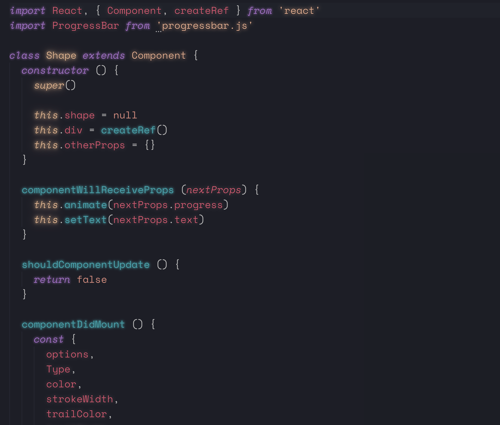

<div align="center">
    
</div>

# neon-horizon-vscode

> Add some neon flair to [Horizon Theme](https://github.com/jolaleye/horizon-theme-vscode)

## Usage

1. Install [Horizon Theme](https://github.com/jolaleye/horizon-theme-vscode) extension.
2. Install [Custom CSS and JS](https://github.com/be5invis/vscode-custom-css) extension.
3. Copy [`neon-horizon.css`](neon-horizon.css) 
4. Add to settings.json:

```json
    "vscode_custom_css.imports": ["file://<path>/neon-horizon.css"],
    "vscode_custom_css.policy": true,
```

5. Activate command `Reload Custom CSS and JS`.
6. Restart

## Credits

Inspired and based on [SynthWave '84 - VS Code theme](https://github.com/robb0wen/synthwave-vscode).

# License

MIT